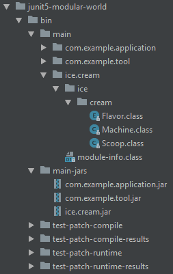

# junit5-modular-world

The project layout structure and command line tools usages are based on proposals
introduced by the [**Module System Quick-Start Guide**](http://openjdk.java.net/projects/jigsaw/quick-start).
Invoke the [jshell](https://docs.oracle.com/javase/9/tools/jshell.htm) script
`./build.jsh` (Windows: `jshell build.jsh`) to build this sample project.

This sample project does not aim to demonstrate how to use the JUnit Platform APIs.
For detailed  information on the JUnit Platform programming and extension models,
please consult the [User Guide](http://junit.org/junit5/docs/current/user-guide/).

## Source Layout

This project hosts three main modules with their associated test modules.
Their names are `com.example.application`, `com.example.tool` and `ice.cream`.

In addition to the main modules there's a test module named `black.box`.
It tests the exported packages and types of the main modules.


## Binary Layout

Main binaries are compiled and packaged using `./compile.jsh`.




## Running Tests

Compiling and running tests is achieved by calling the following test scripts: 

- `test-classpath.jsh`
- `test-patch-compile.jsh`
- `test-patch-runtime.jsh`

```
╷
├─ JQwik Test Engine ✔
│  └─ JQwikTests ✔
│     ├─ exampleFor1And3Equals4 ✔
│     └─ propertyAdd ✔
│           2018-03-06T09:39:40.606157
│              tries = `1000`
│              checks = `1000`
│              seed = `-3387297467304298077`
├─ JUnit Vintage ✔
│  └─ black.box.GoodOldTest ✔
│     └─ eighteenEqualsNineAndNine ✔
├─ JUnit Jupiter ✔
│  ├─ black.box/black.box.BlackBoxTests ✔
│  │  ├─ moduleName() ✔
│  │  ├─ add(RepetitionInfo) ✔
│  │  │  ├─ 1 + 5 ✔
│  │  │  ├─ 2 + 5 ✔
│  │  │  ├─ 3 + 5 ✔
│  │  │  ├─ 4 + 5 ✔
│  │  │  └─ 5 + 5 ✔
│  │  └─ packageName() ✔
│  ├─ com.example.application/com.example.application.MainTests ✔
│  │  ├─ simpleName() ✔
│  │  └─ main() ✔
│  ├─ com.example.tool/com.example.tool.CalculatorTests ✔
│  │  ├─ add() ✔
│  │  ├─ mul() ✔
│  │  └─ pow() ✔
│  ├─ FlavorTests ✔
│  │  └─ random() ✔
│  └─ MachineTests ✔
│     ├─ id() ✔
│     └─ caption() ✔
└─ Ice Cream Machine 47.11 (ice.cream) ✔
   ├─ Stracciatella ✔
   ├─ Stracciatella ✔
   ├─ Chocolate ✔
   ├─ Vanilla ✔
   └─ Stracciatella ✔
```

## Ice Cream Test Engine

The `ice.cream` module demonstrates how to write and register your own `TestEngine`
implementation using the Java Platform Module System.
This engine does not find any tests in containers, but _discovers_ a configurable
amount of ice cream scoops.

### Module Descriptor of the Ice-Cream-Machine

Let's start with the `ice.cream` module descriptor [module-info.java](src/main/ice.cream/module-info.java):

```
module ice.cream {
	requires org.junit.platform.engine;

	provides org.junit.platform.engine.TestEngine with ice.cream.Machine;
}
```

### Implementation of the Ice-Cream-Machine

Here's the outline of the `TestEngine` implementation:

```
package ice.cream;

public class Machine implements TestEngine {

	@Override
	public String getId() {
		return "ice-cream-machine";
	}

	@Override
	public TestDescriptor discover(EngineDiscoveryRequest discoveryRequest, UniqueId uniqueId) {
		...generate Scoops, i.e. TestDescriptors.
	}

	@Override
	public void execute(ExecutionRequest request) {
		..."run" Scoops. Tell engine execution listener what we're doing.
	}
}
```

See classes in package [ice.cream](src/main/ice.cream/ice/cream) for implementation details.

### Running the Ice-Cream-Machine

Sample command line to register and execute the ice.cream machine:

```
java
	-Dscoops=3
	--module-path ...
	--add-modules ALL-MODULE-PATH
	--module org.junit.platform.console
	--scan-modules
```

The standard output could read like this:
```
╷
└─ Ice Cream Machine 47.11 (ice.cream) ✔
   ├─ Stracciatella ✔
   ├─ Stracciatella ✔
   └─ Vanilla ✔
```
